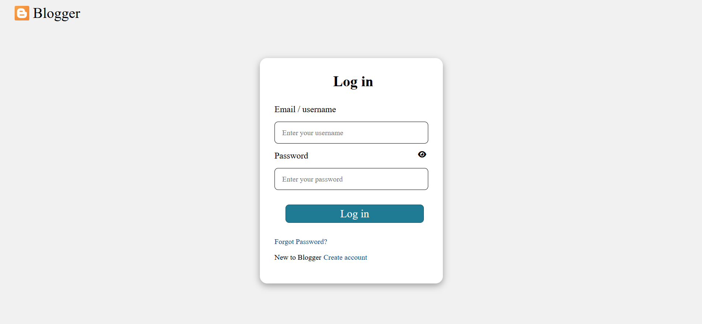

# Internship-Task-5

This project is a dynamic login form created using JavaScript, HTML, and CSS. It includes: 
✅ Real-time email and password validation 
✅ Dynamic error messages without alerts 
✅ Toggle password visibility using an eye icon 
✅ User-friendly UI with interactive elements 

# Features
🔹 Form Validation 

Email Validation: 

No uppercase letters allowed 
Must contain '@' symbol 
Displays error messages below the input 

Password Validation: 

Must be at least 8 characters long 
Displays error messages dynamically 

🔹 Password Visibility Toggle 

Clicking the eye icon switches between password and text input. 
Icon changes dynamically between fa-eye and fa-eye-slash. 

# Technologies Used

HTML – For form structure 
CSS – For styling and error indication 
JavaScript – For dynamic content, form validation, and interactivity 

# Demo link and Screenshot

Demo link :  

Screen shot :  